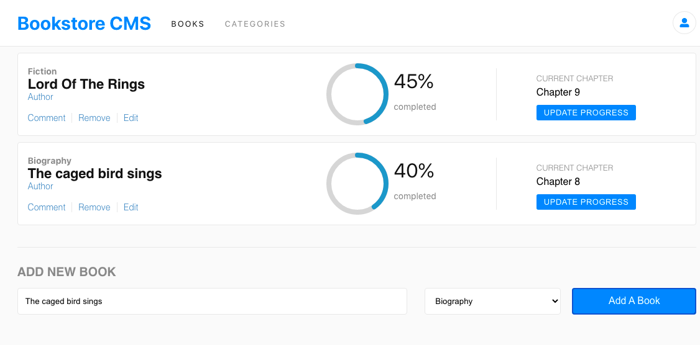

The Bookstore keeps Track of books you're reading and books you'd like to read while recording the progress on each book.

- Displays a list of books.
- Add a book.
- Remove a selected book.

Additional description about the project and its features.

## Built With

- Javascript
- React
- Redux

## Live Demo

[Live Demo Link](https://stupefied-mahavira-79dcd5.netlify.app/)

To get a local copy up and running follow these simple example steps.

Git clone: git@github.com:gracekabaghe/the-book-store.git
npm install 
npm start

## Author

👤 Grace Kabaghe

- GitHub: [@githubhandle](https://github.com/gracekabaghe)
- LinkedIn: [LinkedIn](https://linkedin.com/in/grace-kabaghe)

## 🤝 Contributing

Contributions, issues, and feature requests are welcome!

Feel free to check the [issues page](../../issues/).

## Show your support

Give a ⭐️ if you like this project!

## Acknowledgments

- Hat tip to anyone whose code was used
- Inspiration
- etc

## 📝 License

This project is [MIT](./MIT.md) licensed.